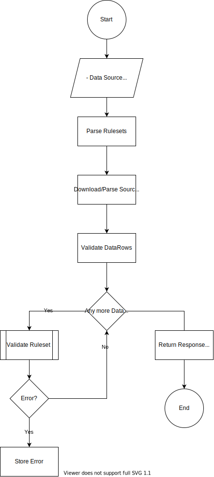

# Columnar Data Validator

This mini project is aimed at consolidating a generic Data Validation specification for columnar data files, e.g. CSV, Xlsx, etc., open to be implemented in any language.

Below are the areas of emphasis:

- Validation Engine Pipeline
- Validation Rules
- Input Spec
- Output Spec

### Validation Engine Pipeline

---

```

```


### Validation Rules

---

Rules should cover destination column definitions + custom rules (optional)

Destination specifics

- [MSSQL](https://docs.microsoft.com/en-us/sql/t-sql/data-types/data-types-transact-sql?view=sql-server-ver15)
- [MySQL](https://dev.mysql.com/doc/refman/8.0/en/data-types.html)
- [PostgreSQL](https://www.postgresql.org/docs/9.5/datatype.html)

Custom Rules:

| Name         | Description                                             | Params                                                 |
| ------------ | ------------------------------------------------------- | ------------------------------------------------------ |
| NotEmpty     | Check for value. Cannot be empty                        |                                                        |
| StringLength | Check string length                                     | - min: number<br />- max: number<br />- exact: number  |
| SumOfColumns | Check that value holds computation from defined columns | - ordinal: number<br />- computationOrdinals: number[] |
| etc...       |                                                         |                                                        |


To research:

- Mapping from `source:[lang_specific | generic] <--> destination:[databases - mssql, mysql, postgresql, etc.]`
- Take a look at strategies taken at ORM such as EF, SQLAlchemy, Gorm, etc.

### Input Spec

---

**rulesets.json**

The file that defines the entire process.

>
> ```
> {
>   "id": string | Guid,
>   "name": string,
>   "destinationType": "MSSQL" | "MySQL" | "PostgreSQL" | etc...,
>   "rulesets": [
>     {
>       "ordinal": number,
>       "rules": [
>         {
>           "rule": ValidationRuleName [ Destination specific - (BIGINT | INT | etc...) | Custom - (NotEmpty | SumOfColumns | etc...)],
> 	  "severity": "Warning" | "Error",
> 	  "params"?: ValidationRuleParams
>         },
>         ...
>       ]
>     },
>     ...
>   ]
> }
> ```

**Data Source**

Define the source of data. Application should then handle the ingestion accordingly.

- Remote
  - Protocol - FTP, SFTP, HTTP, etc.
  - Url
- Stream
- Json

### Output Spec

---

> ```
> {
>   "status": "Success" | "Warning" | "Error",
>   "detail": [
>     {
>       "field": string,
>       "rules": [
>         {
>           "rule": ValidationRuleName [ Destination specific - (BIGINT | INT | etc...) | Custom - (NotEmpty | SumOfColumns | etc...)],
>           "status": "Success" | "Warning" | "Error"
>         },
>         ...
>       ]
>     },
>     ...
>   ]
> }
> ```
